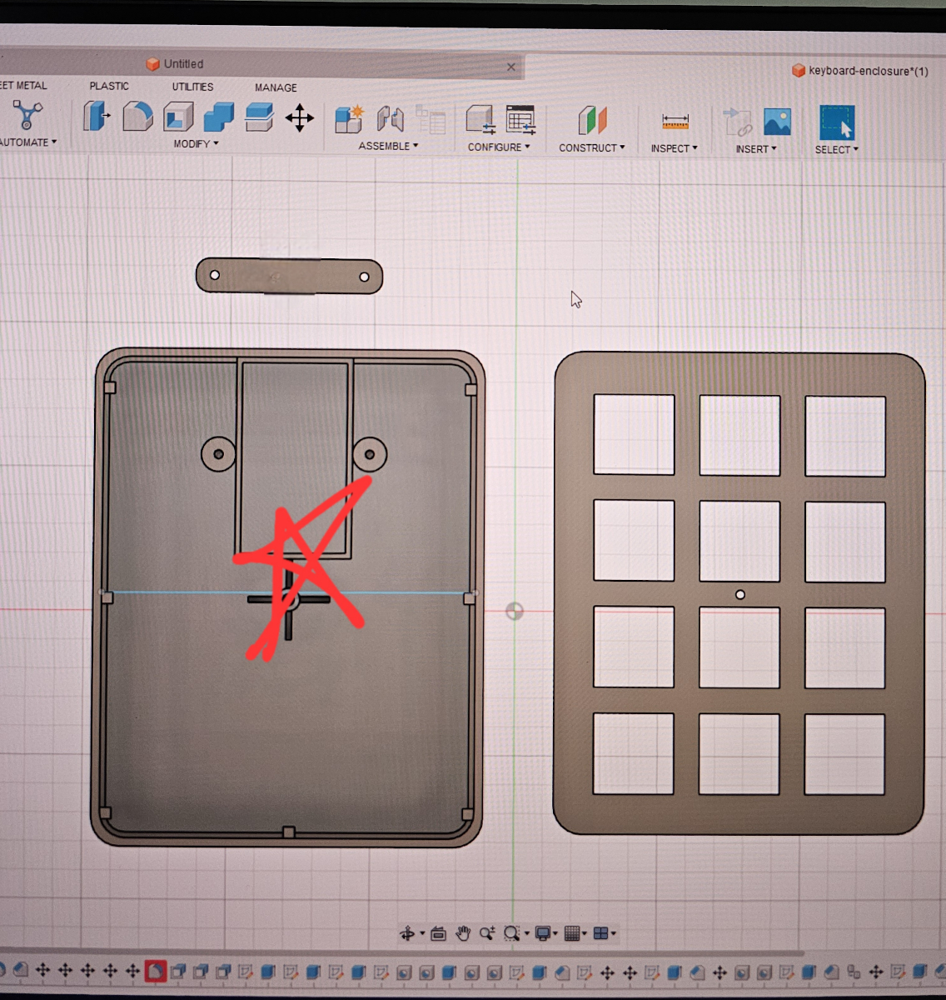
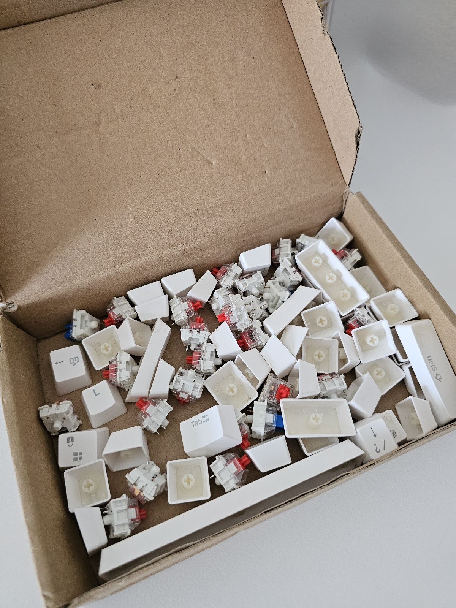
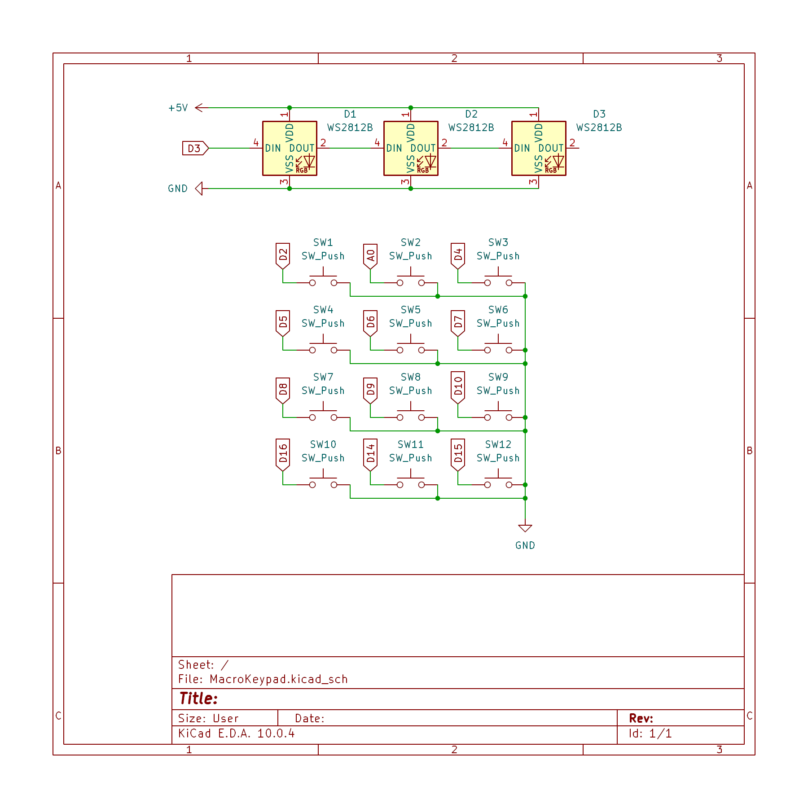
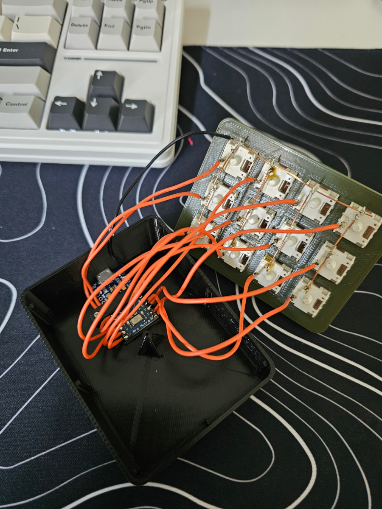
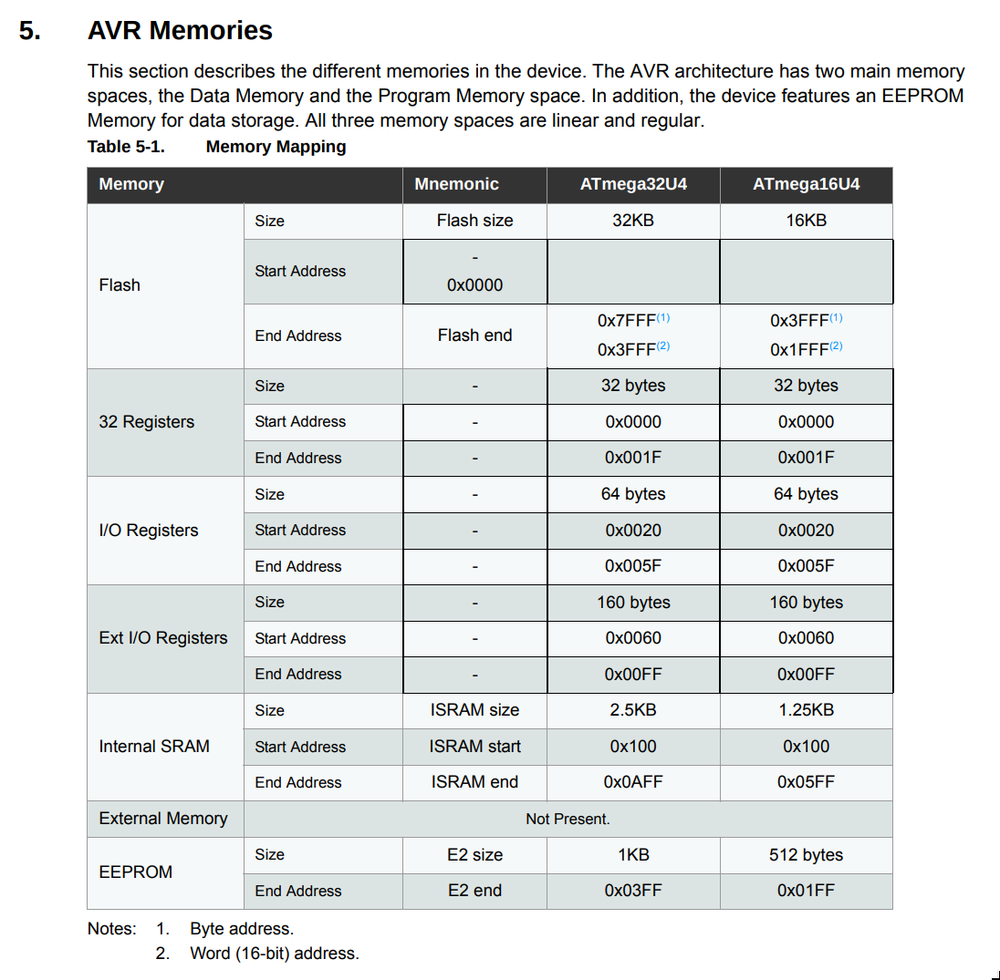
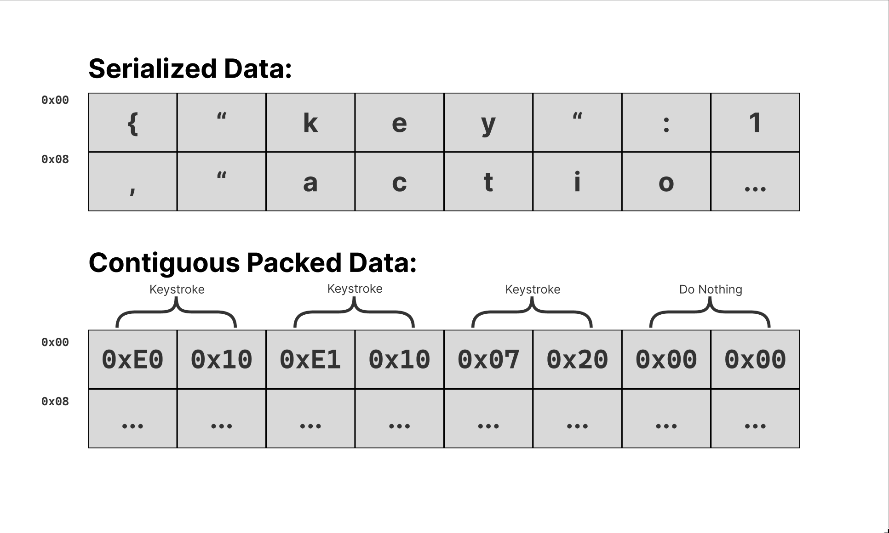

Macro keypads are undoubtably a useful addition to one's productivitiy setup, where each key can be bound to perform a specific action tailored to your needs. They have grown in popularity in the past few years, with some being commercialized and marketed at a very extravagent price for what they are. Some feature displays, knobs, sliders, and offer a wide range of customizability and functionality.

In this blog, I will focus on designing and building a simple, yet affordable macro keypad using widely available components, and is most importantly fully configurable.

## Goals:

## The Enclosure

I started off by designing the enclosure. Something that is compact, ergonomic, easy to 3D print, and most importantly visually appealing. The design process took a few iterations, but I finally settled on a design that mimics the shape of a standalone numpad:

    

I then proceeded to print the parts using the help of my university's facilities. 

The design consists of 3 main parts:
1. Main housing
1. Top switch plate
1. MCU tab

## Parts

| Component | Quantity | Price |
| --------- | :------: | ----- |
| Arduino Pro Micro | 1 | ~$3.30 |
| Mechanical keyboard switches | 12 | ~$3 for 20pcs |
| Mechanical switches keycaps | 12 | ~$6 for a set |
| WS2812b addressable LED strip with 3 leds | 1 | ~$3.25 for 1m of 60 leds |
| Solid core copper wire | - | - |
| Wires to connect everything | - | - |

*All prices were looked up on aliexpress at the time of writing this.

### Why The Pro Micro?

The Arduino Pro Micro comes with an ATmega32u4, a chip capable of emulating Human Interface Devices (HID). It is also widely available and supported. But it is not the only one out there. Take for example the ESP32-S3, or the RP2040, they offer the same functionality and more, but those are too overkill for our current scope. 

Another option of microcontrollers is the WCH lineup. An extremely affordable option (in the price range of cents!), but it does not offer the same developer experience as the Pro Micro. Even though it is officially supported and has an Arduino core, it requires a little more tinkering and installation, unlike the Pro Micro which is just plug and play. 

### Keyboard Parts 

What makes this project very cheap is the ability to use off the shelf parts. Take for example the mechanical keyboard switches and keycaps, I salvaged them from an old, broken keyboard and ended up with a box of them:

    

## Putting Everything Together

First step was to put all 12 keyboard switches into the top plate. Sadly, I don't have a photo of the process.

Next was to solder everything together according to the following schematic:

    

*Analog pins can also be used as digital pins depending on the microcontroller.
 
 

Looking at the schematic above, we can see that the top part represents the led strip later used to indicate the "macro layers", while the middle shows the switch/key matrix.

Solid core copper wires were stripped of their insulation and used to connect the first pin of each key to ground, and normal wires were used for connecting the other pin to its corresponding pin in the microcontroller: 

    

After securing the microcontroller using the 3D printed tab with the help of screws and screwing the top plate in, the keypad is finally done, or at least the hardware part.

## Planning The Keypad's Internal Architecture

Before we start writing any code, we have to figure out a way to save user settings such as what keys to press and what colors to display and so on. The Arduino Pro Micro (ATmega32u4) does not have a big enough flash for a filesystem for us to save the configuration to, so we have to think of an alternative way.

Looking at the [ATmega32u4's datasheet](https://ww1.microchip.com/downloads/en/DeviceDoc/Atmel-7766-8-bit-AVR-ATmega16U4-32U4_Datasheet.pdf), more specifically into the memory mappings, we find the following table:

    

Apart from the small flash size, we see something called EEPROM, and this is what Wikipedia has to say about it:

> EEPROM or E2PROM (electrically erasable programmable read-only memory) is a type of non-volatile memory. It is used in computers, usually integrated in microcontrollers such as smart cards and remote keyless systems, or as a separate chip device, to store relatively small amounts of data by allowing individual bytes to be erased and reprogrammed.

Keyword here is *programmable* and *non-volatile memory* which is exactly what we need. We can use it to store user settings and have it persist until the next MCU boot up. But looking at the size of **1KB**, we can clearly see that we do not have a lot to work with.

### The Challenge

Since we do not have a lot of memory to work with (only 1024 bytes), we have to use this memory wisely and efficiently, and that means accounting for each and every byte used to cram the most amount of user data and functionality into this little thing. Luckily, I have just the right idea on how to do that.

Instead of serializing the data into textual, human-readable formats like JSON or XML, which would contain many useless characters to our macro data like "{" or ":", we can store everything into a contiguous memory block:

    

*Hexadecimal values are in little endian.

Let's say we used 2 bytes to represent a keystroke, that means we were able to store 4 unique keystrokes in 8 bytes! Compare that to serialized data where we were not able to even represent the first half of a keystroke.

But of course, this all comes with a tradeoff: memory management becomes very difficult. Any write to the wrong EEPROM address could corrupt our data, so we have to plan this carefully.

### Mapping The EEPROM

Before planning the entire EEPROM, let's first map the 2 bytes of each keystroke. From now on, the 2 bytes representing a keystroke will be called an action since it is capable of representing more than just a keystroke:

